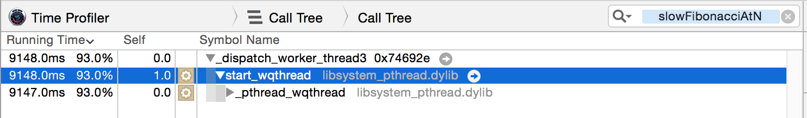

This is a sample project that calculates the Fibonacci sequence, displaying the nth number in the sequence in the corresponding row of a `UITableView`. It also points out benefits of using `Grand Central Dispatch` to move heavy calculations off the main thread.

The `FibonacciGenerator` class can use GCD with a serial queue to move the calculation off the main thread, but keep the sequence in order (in the `generateFibonacciAtN` function). This is not the most optimized method of calculating a Fibonacci sequence. I am using a `Dynamic Programming` approach to store known sequence values in an array rather than recursively calculating every number. I also added some much slower methods to contrast the differences in performance.

## Comparison ##

Here is a Timer Profiler screen shot of the worst-case recursive algorithm running only on the main thread. I only scrolled to n = 34 or so and gave up:

Now I added GCD to lift the Fibonacci calculations off the main thread. You can see the improvement in processing time, but I only made it scrolling to about n = 38 before giving up. Definitely not great:

We can greatly improve performance by improving the Fibonacci algorithm and storing the sequence values we have already calculated in an array. As you can see, this makes a huge difference as I scroll (although a little jumpy) to the max possible n (92) on a 64-bit device:

Now here is a shot of the dynamic GCD version. Notice that this is even faster as I smoothly scrolled to the max possible n (92) on a 64-bit device:

## Wrap Up ##

If you've read this far, you might be a bigger nerd than I am. Suggestions and comments are always welcome!

